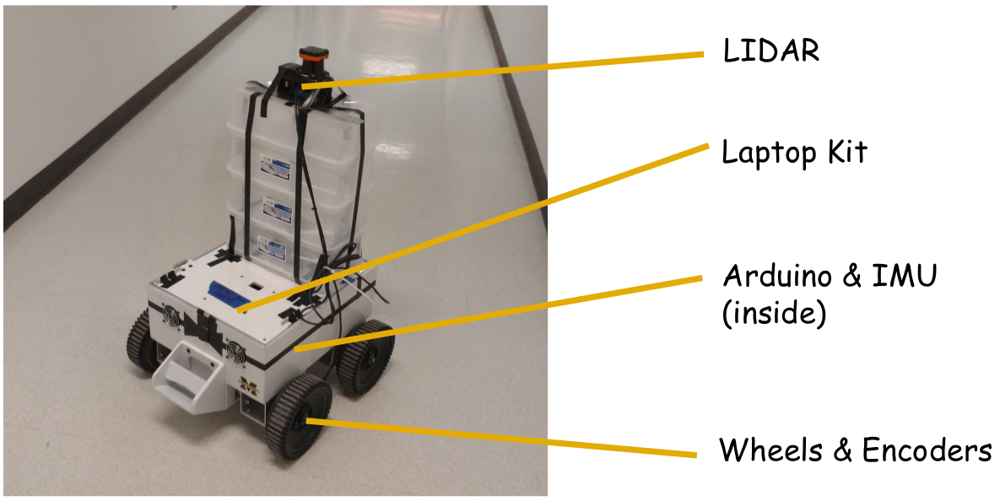
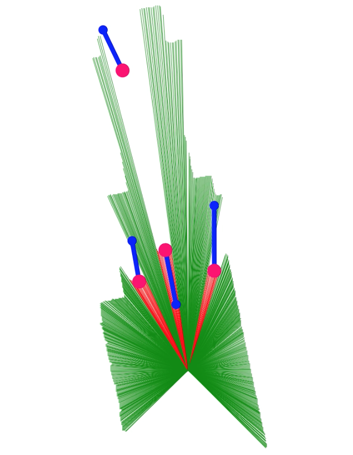
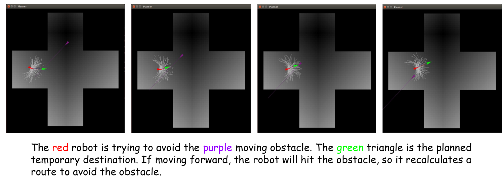
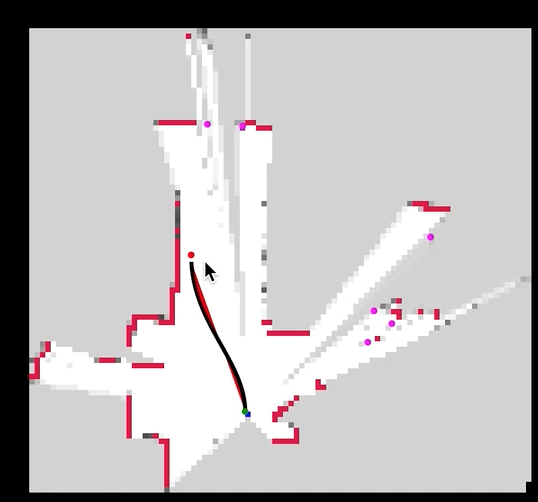

ANDE stands for Autonomous Navigation in Dynamic Environment. It's a whole system that do SLAM and dynamic obstacle avoidance. The solution can be applied to a great number of robots in complex environments. The key difficulty is to recognize moving objects and predict their trajectory as well as accurate action control on a large four-wheel robot. We aim to solve the problem using model optimal control, and test our solutions on MagicBot. 

## What do I do and why is this hard?

This project does not use ROS or any preexisting framework / library, that means we made our own AMCL, rviz and ros-serial equivalent. By the time of the project, the idea of micro-service isn't that popular either.

I made the SLAM code and the whole software architecture of the robot. The backend is written surprising in... Node.js! It runs much faster than Python, while still having lots of libraries and is easier to integrate with frontend. However, due to some performance limitation, it can only spawn 50 particles at max... but that's enough. As I mentioned, we need a rviz equivalent, so I spent huge amount of time making a web GUI by manipulating SVG. The GUI can show 2d map and lidar readings surprisingly well.

For the controller part, we definitely need a faster language, so that part is written in C++, and I glue them together using [nbind](https://github.com/charto/nbind)

All the things are finished in 2 months.

## More technical details
ANDE includes the following components:

- SLAM (Simultaneous Localization and Mapping): 
    - Particle filter localization and occupancy grid mapping
    - Integrate IMU for angle measurement
    - Add side-slip to the action model
    - Require very high accuracy map
- Obstacles detection and tracking:
    - Filter out front-ground with proper size as obstacle candidates. 
    - Use particle filter to match the existing obstacles with new data frame. 
    - Destroy and create tracker automatically.
- Model predictive equilibrium point control (Path planner):
    - Generate potential field based on Manhattan distance to the final destination as navigation guide. 
    - Design a cost function incorporating the penalty for the speed, angular velocity, possible collision with static & dynamic obstacles, and negative progress.. 
    - Pre-sample 200 trajectories as initial guess.
    - Compute optimal short term goal based on the cost function using gradient descent.
- Low-level controller: 
    - Generate speed-independent curve to a given global position with direction. 
    - Compute velocity profile and angular velocity along the designed curve.
- PID velocity controller:
    - Run at a high frequency on micro-controller
    - Compute motor command according to the velocity and angular velocity commands.

