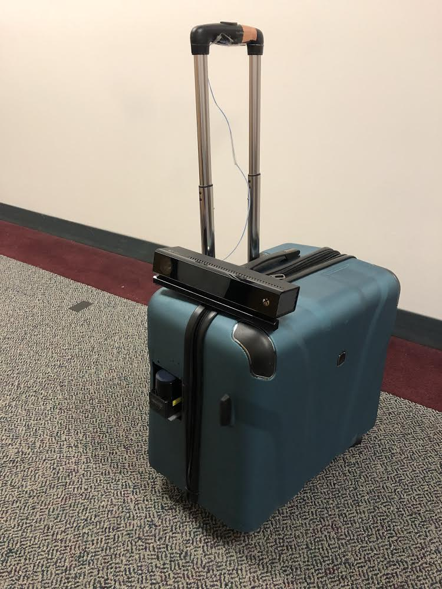
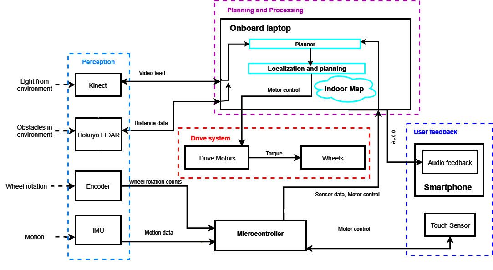

## What is Cabot?

Cabot is an assistive robot designed to help visually impaired users navigate through a new
environment. The user will use this suitcase-shaped robot to aid them in traversing new indoor
environments.

## How does it work?

The cyberphysical architecture is shown above. Lidar and Kinect are the main sensor used, and all the communication is done in ROS. Since it's a robot specifically designed for the blind, we implemented turn-by-turn voice feedback, pedestrain warning as well as dial destination selection interface.

## You always use the word "we", what part do you do then?

Basically I made all the software for Cabot, which are all [opensourced on Github](https://github.com/realCabot). I'm not familiar with the driver system and the PCB design though.

## Want more info?

Visit the [official website for Cabot](https://mrsdprojects.ri.cmu.edu/2017teamg/)