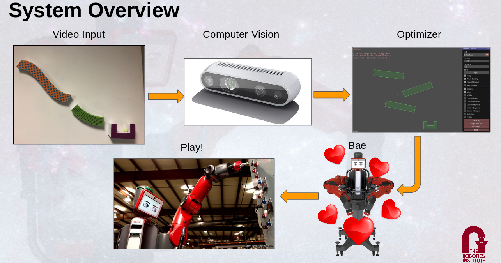
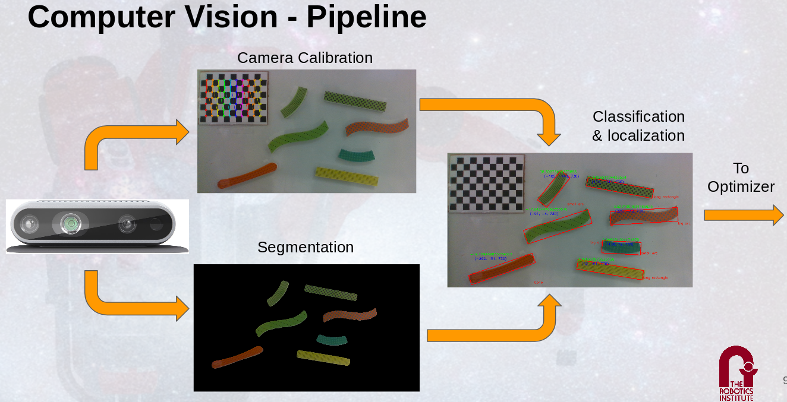
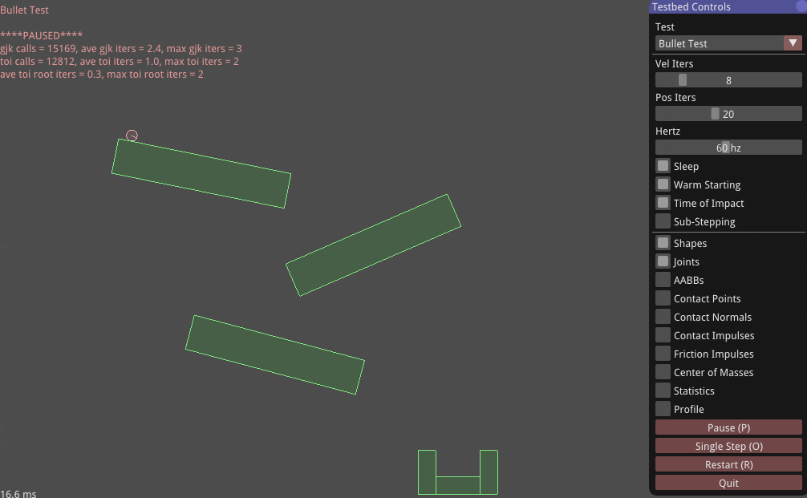

## Vision

## Optimizer

- Find block positions, given the bounds and properties of environment, so ball can successfully travel to the goal position
- Based on the Box2d physics engine
- Use Differential Evolution for optimizer

## Manipulation

## What did I specifically do?

I implemented the optimizer and the interface, source code available at [Github](https://github.com/realMarbleMadness/Box2D)