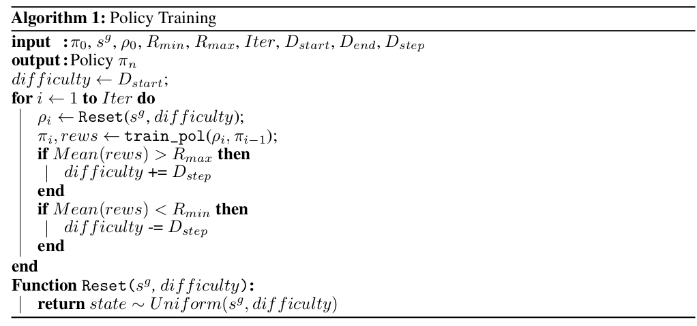
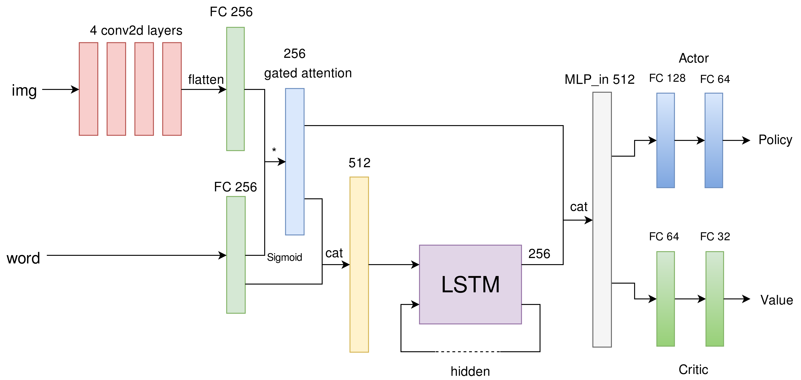

## Introduction
Navigation has been an interesting subject for robots at different scales. From small surgery assistant robot to self driving cars on the road, all kinds of robot needs a robust and efficient navigation algorithm. The traditional approach is to make a map of the whole environment in advance, then plan a path from start location to goal. The approach has several disadvantages. First, it is not prone to environment changes. The map needs to be updated frequently in order to keep up with the changing environment. Second, the method can't be generalized. For every new environment, a new map is needed. 

In order to tackle these problems, we intend to apply end-to-end deep reinforcement learning to solve this problem. To make our training faster, we propose the Boosted Reverse Curriculum Learning (BRCL) algorithm, which is a step forward based on the Reverse Curriculum Generation algorithm proposed by Florensa et al. The key idea is to train the agent gradually from the simple environment to the difficult environment.

### Contribution
We present that reverse curriculum training idea can be applied to complex environment such as house environment, but not just simple maze. The approach of directly taking visual information as input has been practiced by several recent papers, including maze by Mirowski et al. and 3D FPS game by Lample and Chaplot. Our proposed agent combines these state-of-art vision network structure with reverse curriculum learning, producing a fast and end-to-end robot capable of navigation in house environment. Moreover, with some assumptions on the simulation environment, the reverse curriculum training could be boosted without losing performance. 

## Algorithm and network

There is some hyper-parameters we need to pick. $R_{min}$ and $R_{max}$ are used to pick the so-called "good state". These value can easily be interpreted as desired successful rate. $D_{start},~D_{end}~\text{and}~D_{step}$ are the difficulty parameters. Practically, they are the standard deviation of the distribution from which you sample your starting state. The number means how far do you want to go from the goal state.

To summarize the algorithm, the difficulty of the task is dynamically changed based on how good the agent is performing.

### Asynchronous Advantage Actor-Critic

A3C is a variant of policy gradient algorithm introduced by Mnih et al., which reduces the variance of policy gradient by jointly updating a value function as the baseline. Instead of training one agent, the asynchronous way allow training in parallel threads simultaneously. Under this condition, the agents interact with diverse samples of environments which improve the generalization of policy update. 

Suppose we have a discrete policy $\pi(a,s|\theta)$ and a value function $v(s|\theta)$. The policy function return probabilities of all actions for given state and the value function return value of current state. The goal of A3C is to optimize the policy by minimizing the loss function
$$
L_{\text{pg}}(\theta) = -\mathbb{E}_{s_t,a_t,r_t} \left[ \sum_{t=1}^{T}(R_t-v(s_t))\log\pi(a_t,s_t|\theta) \right]
$$
where $R-t$ is the discounted accumulative reward defined by $R_t=\sum_{i=0}^{T-t}\gamma^i r_{t+i} + v(s_{T+1})$.
The value function is updated by minimizing the loss

### Gated-LSTM Network for Discrete Policy

#### State Encoding

The agent operates on raw pixel frames $X_t$, which are passed through a convolutional network and extracted image features $x_t$. For adding the target into the network, we applied a gated fusion module to derive a state representation $h_t=M(x_t,I|\theta)$ at each time step t. Then, the target is concatenated with $h_t$ and the result is fed into the LSTM module to obtain a sequence of LSTM outputs, so that the LSTM module has direct access to the target other than the attended visual features.

#### Gated-Attention for Feature Fusion

For the fusion module $M(x, y|\theta)$, the straightforward version is concatenation. In this approach, the image feature and instruction are simply flatten and concatenated to create a joint state representation, $M_{cat}(x, y|\cdot) = [x, y]$. 

In this task, input $x$ is a high-dimensional feature vector (i.e., image feature) while $y$ is a simple low-dimensional one-hot vector (e.g., instruction). Simple concatenation with severe unbalanced dimension may cause optimization difficulties in the training process. Thus, we choose to use a gated-attention mechanism. The instruction embedding is passed through a fully-connected linear layer with Sigmoid activation function. Suppose $x \in R^{d_x}$ and $y \in R^{d_y}$ where $d_y < dx$. We transform $y$ to $y' \in R^{d_X}$ via an MLP, namely $y' = f_{mlp}(y|\theta)$, the output dimension of this linear layer is equal to the number of feature maps in the output of the convolutional network. Then perform a pointwise product between $x$ and Sigmoid($y'$), which leads to our final gated fusion module $M(x, y|\theta) = x \odot sigmoid(f_{mlp}(y|\theta))$. This gated fusion module could also be interpreted as an attention mechanism over the feature vector which could help better shape the feature representation.

#### Policy and Value Function

After concatenation of the output from LSTM and gated attention, we splitted this result into two different two-layer MLPs to build the policy and the value function. 

## Results

We tested on House3D environment. The theory sounds good on paper but it does not work in practice. The result is a complete failure so let's just end here, all right?
